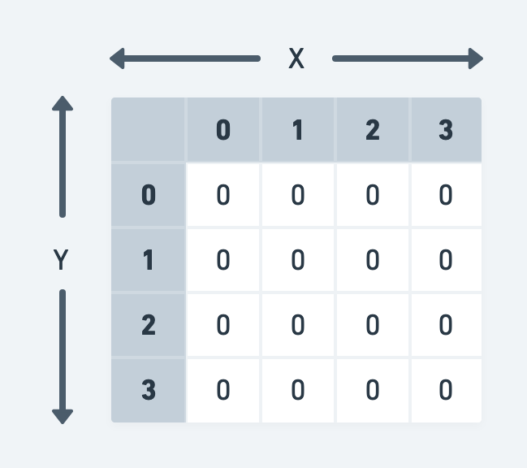
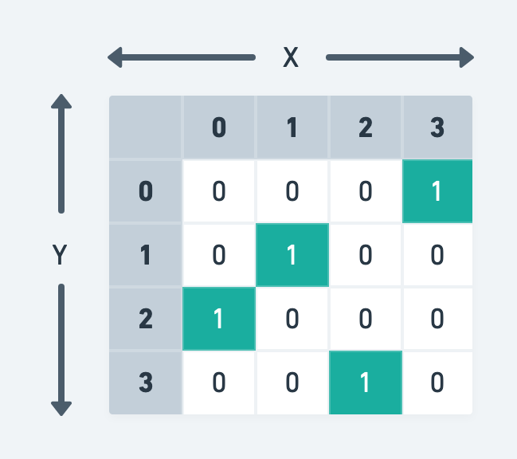
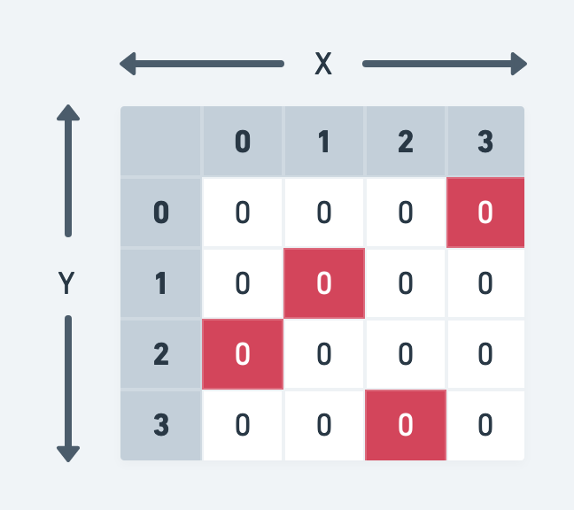

# Battleship Game

For this assignment, all changes will be made within the `index.js` file.

Some code has already been provided for you; all your changes will be made in the `battleship()` function.

## Step 1: Create Players

For this game, you will need **two players**.

Each player should have a "name", "ship count", and "game board" which means you will need to use an object. Below are the default values for each object property:

| Property  | Type   | Default Value                                                    |
| --------- | ------ | ---------------------------------------------------------------- |
| name      | String | User-provided via the `prompt()` function                        |
| shipCount | Number | `4` (the number of ships each player starts with)                |
| gameBoard | Array  | 2-dimensional array with 4 rows and 4 columns, filled with zeros |

Here's how each player's default board would look in visual form:

## Step 2: Randomly Add Ships to each Board

Each player's board will start with **four ships**.

The ships should be placed randomly, which means you will need to do the following steps for each player's board:

1. Create a loop that runs until 4 ships have been added to the board
2. Inside the loop, generate a random `x` and a random `y` coordinate (must be between 0 and 3)
3. Check if the board space (array element) at those coordinates has a ship or not:
   - If not, "add a ship" (change the value from `0` to `1`) and increment the total added ships counter
   - If yes, let the loop continue (do nothing)

Here's an example of how a player's board would look in visual form:

| Ship | Coordinates |
| :--: | :---------: |
|  1   |   (0, 3)    |
|  2   |   (1, 1)    |
|  3   |   (2, 0)    |
|  4   |   (3, 2)    |

## Step 3: Start the Game Play

You will need to loop through the following steps, switching between players 1 and 2, until one of the players wins.

### Step 3a: Ask the Player to Choose Strike Coordinates

Using the `prompt()` function, ask the current player to choose an `x` and `y` coordinate to strike. You will need to store the user's input in a variable(s) for the next step.

### Step 3b: Determine if the Player Sunk their Opponent's Ship

Using the `x` and `y` coordinates from the previous step, check the opponent's board to see if the space (array element) at those indices is a ship (is equal to `1`).

- If yes, "sink the ship" (change the value from `1` to `0`), decrement the opponent's ship count, and show an alert that says "Hit!"
- If not, show an alert that says "Miss!" and let the loop continue (do nothing)

Here's an example of how the opponent's board might look in visual form:

### Step 3c: Check if the Opponent has Any Ships Left

Having decremented the opponent's ship count, check if the number is still greater than zero.

- If not, the game has ended and the current player won
- If yes, let the loop continue (do nothing) and switch to the other player

Here's an example of how the opponent's board might look in visual form:

## Step 4: End the Game Play

Once a player has won the game, the function should return a message stating the results. Here's an example:

> The winner is Player 1!
